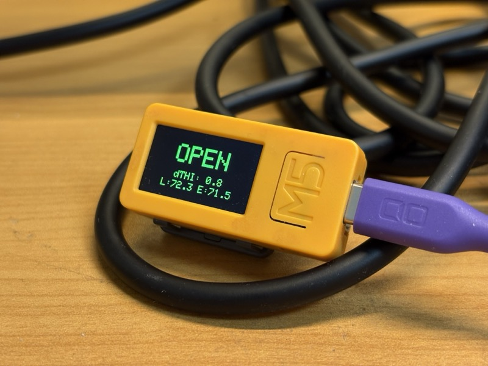

# STICKCPLUS2-THI-AirGate

[🇺🇸 English](README.md)

M5StickCPlus2 を使用した通風口運用支援システムです。2つの場所の温湿度指数（THI）の差を可視化し、通風口の開閉判断に役立つ情報を表示します。

## デバイス写真



## 機能

- **自動ディスプレイ回転**: IMU（加速度計）で重力を検知し、通常（0°）と反転（180°）の横長表示を自動切り替え
- **MQTT データ受信**: 2つの場所（リビング・玄関）から THI 値を MQTT で受信
- **スマート通風口制御**: THI の差分に基づいて自動開閉、ヒステリシスで開閉チャタリング防止
- **焼付き防止**: アイドル時に動くスクリーンセーバーを表示
- **モーション起動**: 端末を揺らす・触れると、スクリーンセーバーから通常表示に復帰
- **データ有効性監視**: 30秒以上受信なしで OFFLINE 状態に表示
- **堅牢な接続処理**: WiFi/MQTT はノンブロッキング、タイムアウト・リトライ上限設定
- **OFFLINE フェイルセーフ**: データが古い/欠落時は通風口状態を強制 CLOSE
- **自己復旧**: 長期稼働安定化のため、24時間ごとに自動再起動
- **ヘルスログ**: 起動回数・再接続回数・データ鮮度を定期出力
- **動的ディスプレイレイアウト**: 画面サイズに応じた UI 自動調整
- **詳細エラーログ**: シリアル出力に WiFi・MQTT・JSON パースの詳細情報

## ハードウェア要件

- **M5StickCPlus2**: IMU・WiFi・TFT ディスプレイ搭載メインコントローラ
- **USB-C 電源アダプター**: 常時給電用（外部電源供給）
- **MQTT ブローカー**: ネットワーク上の MQTT サーバ

## ソフトウェア要件

- **Arduino IDE** または **PlatformIO**
- **M5StickCPlus2 ボードサポートパッケージ**（ESP32 3.3.7 以上）
- **Arduino ライブラリ**:
  - M5StickCPlus2
  - WiFi
  - PubSubClient
  - ArduinoJson

## インストール

### 1. プロジェクトのクローン・ダウンロード
```bash
git clone <repository-url>
cd STICKCPLUS2-THI-AirGate
```

### 2. ボードサポートのインストール
Arduino IDE で:
- **ファイル** → **環境設定** → **追加のボードマネージャーURL**
- 追加: `https://m5stack.oss-cn-shenzhen.aliyuncs.com/resource/arduino/package_m5stack_index.json`
- **ツール** → **ボード** → **ボードマネージャー** → "M5" で検索 → "M5Stack by M5Stack Official" をインストール

### 3. ライブラリのインストール
**スケッチ** → **ライブラリをインクルード** → **ライブラリを管理**:
- 以下を検索・インストール: `M5StickCPlus2`、`PubSubClient`、`ArduinoJson`

### 4. 設定ファイルの編集
```bash
cp config.example.h config.h
```

`config.h` を編集し、WiFi と MQTT 設定を記入:
```cpp
#define WIFI_SSID "Your-WiFi-SSID"
#define WIFI_PASSWORD "Your-WiFi-Password"
#define MQTT_BROKER "192.168.x.x"
#define MQTT_PORT 1883
#define MQTT_TOPIC_LIVING "home/sensor/living"
#define MQTT_TOPIC_ENTRANCE "home/sensor/entrance"
#define THI_OPEN_DIFF 0.5
#define THI_CLOSE_DIFF 0.2
```

### 5. デバイスへのアップロード
- ボード選択: **ツール** → **ボード** → **M5Stack** → **M5Stick-C PLUS2**
- ポート選択: **ツール** → **ポート** → `/dev/tty.usbserial-xxxxx`
- **スケッチ** → **マイコンボードに書き込む**（Ctrl+U）

## 設定

### MQTT トピック
- **リビング**: リビング側の THI を受信するトピック
- **玄関**: 玄関側の THI を受信するトピック

JSON ペイロード形式:
```json
{"thi": 23.5}
```

### THI ヒステリシス
- `THI_OPEN_DIFF`: 通風口を開ける条件 `livingTHI - entranceTHI ≥ 値`
- `THI_CLOSE_DIFF`: 通風口を閉める条件 `livingTHI - entranceTHI ≤ 値`

デフォルト: 開 ≥ 0.5、閉 ≤ 0.2

### ディスプレイパラメータ
以下のパラメータを編集（`config.h` とスケッチ定数）:
- `DISPLAY_BRIGHTNESS_NORMAL`（`config.h`）: 通常表示時の輝度（0-255）
- `DISPLAY_SAVER_DIM_PERCENT`（`config.h`）: スクリーンセーバー時の減光率（0-100）
- `NORMAL_DISPLAY_HOLD_MS`: モーション検知後に通常表示を保つ時間（15000ms = 15秒）
- `MOTION_DELTA_THRESHOLD`: モーション・振動検知の感度（デフォルト 0.18）
- `DATA_TIMEOUT_MS`: データ OFFLINE 判定までの時間（30000ms = 30秒）
- `WIFI_CONNECT_TIMEOUT_MS`: WiFi 接続タイムアウト（30000ms = 30秒）
- `AUTO_REBOOT_INTERVAL_MS`: 自己復旧のための自動再起動間隔（デフォルト24時間）
- `HEALTH_LOG_INTERVAL_MS`: ヘルスログ出力間隔（デフォルト60秒）

## 使用方法

### 通常動作
1. USB-C で電源を接続
2. デバイスが WiFi に接続を試みる（表示: "WiFi..."）
3. 成功時、MQTT に接続を試みる（表示: "MQTT..."）
4. 接続後、現在の通風口状態（OPEN/CLOSE）と THI 値を表示
5. MQTT からデータが届くと状態が更新される

### ディスプレイモード

**通常表示モード**（モーション検知後・復帰中）:
- 大きな状態テキスト（OPEN/CLOSE）カラー表示
- THI 差分（dTHI）
- リビング・玄関の THI 値
- データが古い場合は [OFFLINE] 表示

**スクリーンセーバーモード**（15秒以上アイドル時）:
- 画面を漂う「OPEN」または「CLOSE」のアニメーション
- 現在の状態カラー表示（緑=OPEN、赤=CLOSE）
- "Shake/Touch to wake" メッセージ

### 自動機能

- **ディスプレイ回転**: 端末を傾けると表示が通常・180° 反転で切り替わる
- **モーション復帰**: 端末を揺らす・触れるとスクリーンセーバーから復帰
- **状態カラー**:
  - 緑: OPEN
  - 赤: CLOSE
  - 黄: WAIT（データ待機中）
  - オレンジ: [OFFLINE]（データ古化）

## トラブルシューティング

### WiFi 接続できない
- `config.h` の SSID とパスワードを確認
- デバイスが WiFi 範囲内にあるか確認
- M5StickCPlus2 は 2.4GHz WiFi のみ対応（5GHz 不可）
- WiFi 失敗時もスクリーンセーバーで動作継続

### MQTT 接続できない
- `config.h` のブローカーアドレスとポート確認
- MQTT ブローカーが起動・接続可能か確認
- ファイアウォールがポート 1883 をブロックしていないか確認
- シリアル出力で詳細なエラーコードを確認

### データが更新されない
- `config.h` の MQTT トピックがブローカーと一致するか確認
- センサーが "thi" フィールドを含む有効な JSON を送信しているか確認
- 30秒以上無受信の場合、フェイルセーフで CLOSE 固定になる
- データが古い間は [OFFLINE] が表示される
- シリアル出力で JSON パースエラーを確認

### ディスプレイの問題
- **ちらつき**: 状態変化時は正常、すぐに安定すべき
- **回転が働かない**: より意識的に端末を傾ける
- **スクリーンセーバーが動かない**: `SAVER_FRAME_INTERVAL_MS` 設定を確認

### シリアル デバッグ
USB 接続時、シリアルモニタ（115200 ボー）で以下を確認:
- WiFi 接続状態
- MQTT 接続試行・エラー
- 受信した THI 値
- データタイムアウト警告
- JSON パースエラー（詳細含む）
- 起動回数（永続化）
- WiFi/MQTT 再接続回数
- 最終受信時刻とデータ経過時間

## 技術詳細

### アーキテクチャ
- **継続ポーリング**: 10ms メインループで IMU 反応性確保
- **イベント駆動描画**: 状態変化時だけ再描画（ちらつき防止）
- **デュアル IMU 機能**: 重力検知（回転）+ 動き検知（復帰）
- **ノンブロッキング設計**: WiFi・MQTT はタイムアウトで復帰
- **フェイルセーフ方針**: OFFLINE/データ古化時は通風口状態を CLOSE に固定
- **定期自己復旧**: 固定稼働時間ごとに自動再起動（デフォルト24時間）

### 主要な状態変数
- `currentState`: "OPEN"、"CLOSE"、"WAIT"
- `dataOffline`: データが古い場合 true
- `bootCount`: 起動回数（NVS に永続化）
- `mqttReconnectCount` / `wifiReconnectCount`: 再接続回数の監視カウンタ
- `isNormalDisplayActive()`: 復帰タイムアウト中なら true
- `gateOpen`: 通風口の開閉状態（ヒステリシス）

### 更新間隔
- 回転チェック: 200ms
- モーション検知: 100ms
- ディスプレイ更新: 可変（状態変化時のみ）
- MQTT リコネクト: 5秒間隔、最大 5 回試行
- ヘルスログ出力: 60秒間隔
- 自動再起動: 24時間間隔（デフォルト）

## ファイル構成

```
STICKCPLUS2-THI-AirGate/
├── STICKCPLUS2-THI-AirGate.ino  # メインスケッチ
├── config.h                      # 設定ファイル（秘密に！）
├── config.example.h              # 設定ファイルの雛形
├── README.md                     # 英語ドキュメント
├── README.ja.md                  # 日本語ドキュメント
├── .gitignore                    # Git 除外ルール
└── .vscode/                      # VS Code 設定
```

## セキュリティ注記

- `config.h` には WiFi・MQTT 認証情報が含まれます。**公開しないでください**
- `config.h` を `.gitignore` に追加し、誤ったコミットを防いでください
- プロジェクト共有時は `config.example.h` をテンプレートとして提供
- WiFi は WPA2 セキュリティを使用
- MQTT ブローカーの認証情報を定期的に変更

## 今後の拡張予定

- 物理ボタンでのマニュアルモード
- Web インターフェースでの設定
- SD カードへのデータログ機能
- 複数センサー対応
- ヒステリシス値を MQTT で調整可能に
- Home Assistant 連携

## ライセンス

MIT ライセンス - 詳細は [LICENSE](LICENSE) ファイルを参照してください。

Copyright (c) 2026 omiya-bonsai

## 作成者

omiya-bonsai

## 開発メモ

本プロジェクトは AI コーディング支援（GitHub Copilot / LLM）を活用して開発しています。
ただし、コード・設定・動作確認は作成者がレビューしています。

## サポート

問題、質問、提案がある場合:
- シリアル出力の詳細ログを確認
- MQTT ブローカー設定が一致しているか確認
- M5StickCPlus2 ボードサポートパッケージが最新か確認
